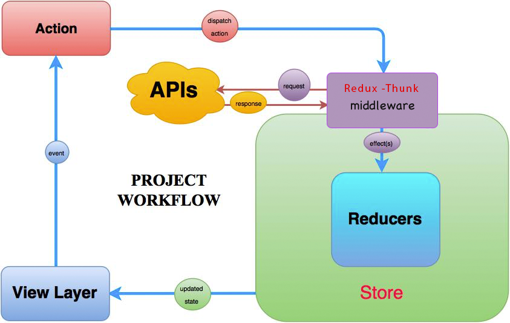

## Backend Restful API

- Express.js

* get one item by id

  - get http://localhost:3000/msgs/1

* delete one item by id

  - delete http://localhost:3000/msgs/1

* update one item by id and the new item object

  - put http://localhost:3000/msgs/3

  - JSON format: {"id" : 3, "msg" : "asd999"}

* get list

  - get http://localhost:3000/msgs/

* post one item

  - post http://localhost:3000/msgs/
  - JSON format: {"id" : 4, "msg" : "asd66"}

* Enable CORS on Express
  - https://daveceddia.com/access-control-allow-origin-cors-errors-in-react-express/

## Frontend React + Redux

- Use redux-thunk as middleware to async fetch data from API server

- Use axios to get, post, delete and put backend API server 